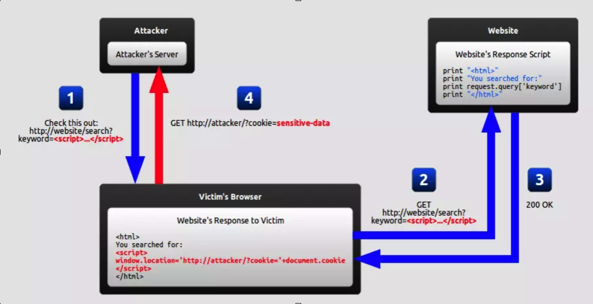
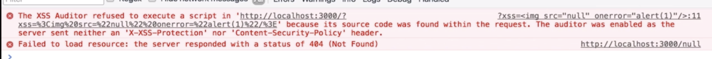
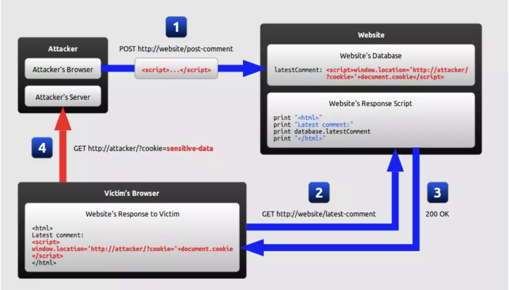
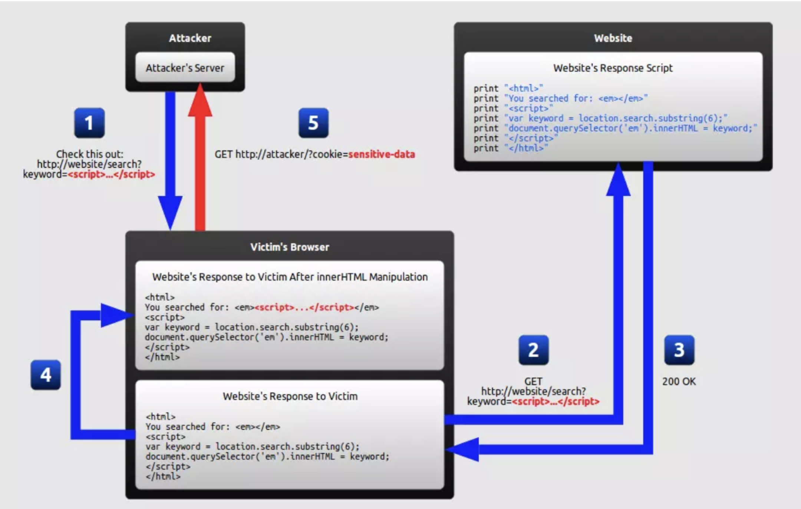
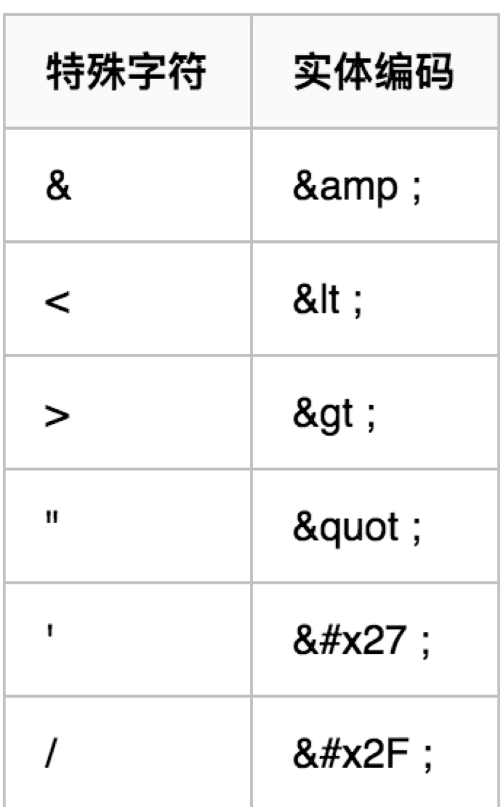
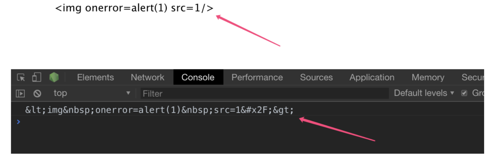

# XSS攻击

### 定义
Cross-Site Scripting（跨站脚本攻击）：简称 XSS，是一种代码注入攻击。攻击者通过在目标网站上注入恶意脚本，使之在用户的浏览器上运行。利用这些恶意脚本，攻击者可获取用户的敏感信息如 Cookie、SessionID 等，进而危害数据安全。
* * ** * ** * ** * *
### 分类
|  类型 | 存储区  | 插入点|
|  ----- | -----| ---- |
| 反射型XSS  | URL | HTML | 
| 存储型XSS  | 后端数据库 |HTML | 
| DOM型XSS  | 后端数据库/前端存储/URL |前端Javascript | 

存储区：恶意代码存放的位置；  
插入点：由谁取得恶意代码，并插入到网页上；

* * ** * ** * ** * *
###  反射型XSS(引诱)

1.攻击步骤：攻击者构造出特殊的 URL，其中包含恶意代码。用户打开带有恶意代码的 URL 时，网站服务端将恶意代码从 URL 中取出，拼接在 HTML 中返回给浏览器。用户浏览器接收到响应后解析执行，混在其中的恶意代码也被执行。   
2.危害 3.引诱4.非持久型5.场景：通过 URL 传递参数的功能，如网站搜索、跳转等  
在部分情况下，恶意代码加载外部的代码，用于执行更复杂的逻辑；恶意代码窃取用户数据并发送到攻击者的网站，或者冒充用户的行为，调用目标网站接口执行攻击者指定的操作。

浏览器默认会阻止XSS脚本执行

* * ** * ** * ** * *
###  存储型XSS

1.步骤：攻击者将恶意代码提交到目标网站的数据库中。用户打开目标网站时，网站服务端将恶意代码从数据库取出，拼接在 HTML 中返回给浏览器。用户浏览器接收到响应后解析执行，混在其中的恶意代码也被执行。  
2.危害；  
3.持久型：恶意代码存在数据库里，下次请求目标页面时不用再提交xss代码； 
4.场景：常见于带有用户保存数据的网站功能，如论坛发帖、商品评论、用户私信等。

* * ** * ** * ** * *
###  DOM型

攻击步骤：攻击者构造出特殊的 URL，其中包含恶意代码。用户打开带有恶意代码的 URL。用户浏览器接收到响应后解析执行，前端 JavaScript 取出 URL 中的恶意代码并执行。  
区别：反射型XSS会将语句存储于后端再出现在前端页面，而DOM型XSS漏洞直接将语句存储于前端。

* * ** * ** * ** * *
### 区别
|  类型 | 存储区  | 插入点|
|  ----- | -----| ---- |
| 反射型XSS  | URL | HTML | 
| 存储型XSS  | 后端数据库 |HTML | 
| DOM型XSS  | 后端数据库/前端存储/URL |前端Javascript | 

DOM 型 XSS 攻击中，取出和执行恶意代码由浏览器端完成，属于前端 JavaScript 自身的安全漏洞，而其他两种 XSS 都属于服务端的安全漏洞。

* * ** * ** * ** * *
### XSS攻击两大要素
攻击者提交恶意代码;  
浏览器执行恶意代码;

* * ** * ** * ** * *
### XSS攻击来源
- URL 参数
- 来自用户的 UGC 信息
- POST 参数
- 来自第三方的链接
- Referer （可能来自不可信的来源）
- Cookie （可能来自其他子域注入）

* * ** * ** * ** * *
### XSS攻击来源
- 在 HTML 中内嵌的文本中，恶意内容以 script 标签形成注入。
- 在内联的 JavaScript 中，拼接的数据突破了原本的限制（字符串，变量，方法名等）。
- 在标签属性中，恶意内容包含引号，从而突破属性值的限制，注入其他属性或者标签。
- 在标签的 href、src 等属性中，包含 javascript: 等可执行代码。
- 在 onload、onerror、onclick 等事件中，注入不受控制代码。
- 在 style 属性和标签中，包含类似 background-image:url("javascript:..."); 的代码（新版本浏览器已经可以防范）。
- 在 style 属性和标签中，包含类似 expression(...) 的 CSS 表达式代码（新版本浏览器已经可以防范）。

* * ** * ** * ** * *
### 危害
- 盗取各类用户帐号，如机器登录帐号、用户网银帐号、各类管理员帐号；
- 非法转账；
- 控制企业数据，包括读取、篡改、添加、删除企业敏感数据的能力；
- 盗窃企业重要的具有商业价值的资料；
- 强制发送电子邮件；
- 网站挂马；
- 控制受害者机器向其它网站发起攻击；

* * ** * ** * ** * *
### XSS防御
Fixfox的CSP、IE8内置的xss filter、chrome浏览器自带防御,可拦截反射性XSS（HTML内容和属性），js和富文本无法拦截等

* * ** * ** * ** * *
### HttpOnly
HttpOnly 最早是由微软提出，并在 IE 6 中实现的，至今已经逐渐成为一个标准，各大浏览器都支持此标准。具体含义就是，如果某个 Cookie 带有 HttpOnly 属性，那么这一条 Cookie 将被禁止读取，也就是说，JavaScript 读取不到此条 Cookie，不过在与服务端交互的时候，Http Request 包中仍然会带上这个 Cookie 信息，即我们的正常交互不受影响。

__但是,HttpOnly 不是万能的，添加了 HttpOnly 不等于解决了 XSS 问题。严格的说，HttpOnly 并非为了对抗 XSS ，HttpOnly 解决的是 XSS 后的 Cookie 劫持问题，但是 XSS 攻击带来的不仅仅是 Cookie 劫持问题，还有窃取用户信息，模拟身份登录，操作用户账户等一系列行为。
使用 HttpOnly 有助于缓解 XSS 攻击，但是仍然需要其他能够解决 XSS 漏洞的方案。__

* * ** * ** * ** * *
### 输入检查
    不要相信用户任何的输入内容！！！！！

过滤用户上传的DOM属性，如onerror等
过滤用户上传的Style节点 、Script节点、Iframe节点等

用户输入昵称：<|无敌是多么鸡毛|>  =>   |无敌是多么鸡毛| ，直接改变了用户的昵称。
所以，我们不能完全信赖开源的 XSS Filter ，很多场景需要我们自己配置规则，进行过滤。

__对用户的输入进行格式校验，过滤一些不合法的内容，但是由于这些过滤工具不了解上下文，所以有的时候就误过滤__

* * ** * ** * ** * *
### 输出检查

不要以为在输入的时候进行过滤就万事大吉了，恶意攻击者们可能会层层绕过防御机制进行 XSS 攻击，一般来说，所有需要输出到 HTML 页面的变量，全部需要使用编码或者转义来防御。

* * ** * ** * ** * *
### 编码

HTMLEncode编码
|   |   |
|  ----- | -----| 

* * ** * ** * ** * *
### 其他XSS防御

Content Security Policy（内容安全策略）：
- 禁止加载外域代码，防止复杂的攻击逻辑。
- 禁止外域提交，网站被攻击后，用户的数据不会泄露到外域。
- 禁止内联脚本执行（规则较严格，目前发现 github 使用）。
- 禁止未授权的脚本执行（新特性，Google Map 移动版在使用）。
- 合理使用上报可以及时发现 XSS，利于尽快修复问题。  
输入内容长度控制  
其他安全措施
- 验证码  

 内容安全策略：实质就是白名单制度，开发者明确告诉客户端，哪些外部资源可以加载和执行，大大增强了网页的安全性。CSP浏览器兼容性，安卓和IE支持不太理想  
输入内容长度控制
对于不受信任的输入，都应该限定一个合理的长度。虽然无法完全防止 XSS 发生，但可以增加 XSS 攻击的难度。
验证码：防止脚本冒充用户提交危险操作。

* * ** * ** * ** * *
### 检测
https://github.com/Arachni/arachni   
https://github.com/mozilla/http-observatory/  
https://github.com/andresriancho/w3af  
https://github.com/s0md3v/XSStrike

* * ** * ** * ** * *
### 参考

https://mp.neixin.cn/cms/content/article/Ra8QGSQ28HEM790I016wEE2hdca1vVzk
https://www.imooc.com/article/252521   《白帽子讲web安全》
https://www.cnblogs.com/liangyin/p/9714283.html